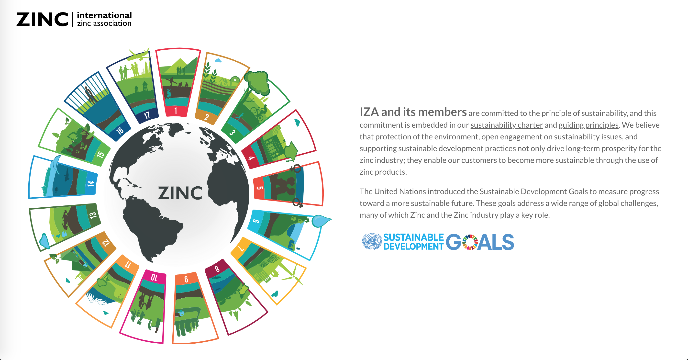
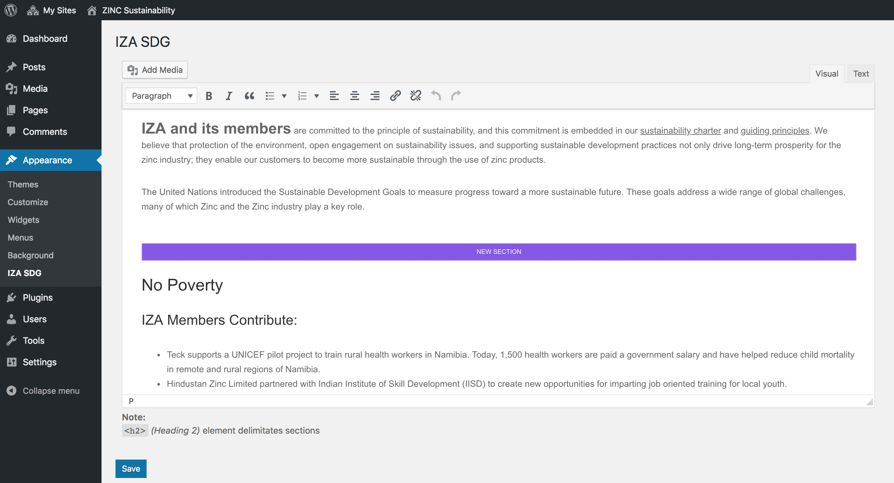

# IZA-SDG

Interactive SVG graphic highlighting the International Zinc Association (IZA) and its members' committment to the United Nations 17 Sustainable Development Goals (SDGs) featured on the zinc.org sustainability microsite: [sustainability.zinc.org](https://sustainability.zinc.org).

## Use

Add shortcode `[iza_sdg]` to WordPress page content.

Divi: insert shortcode inside a "code" or "full-width code" module.



## Admin

Text editing and administrative interface is located under `Appearance > IZA SDG` in the WordPress Admin menu.



## Development

* Uses **yarn**, **webpack** and **browsersync**.
    * Dependancies are managed with `package.json` (yarn)
    * Builds are managed with `webpack.config.js` (webpack)

Source files are located in `/src` and are compiled to `/dist` by **yarn** scripts (see below). **WARNING:** *Do not directly edit files in `src` as they will be overwritten on the next compile!*

### How does it work

1. [Install Yarn](https://yarnpkg.com/en/docs/install)
2. Initilize Project

    ```sh
    yarn
    ```

3. Available commands

    1. **Dev**

        starts browsersync, compiles your js and scss, creates sourcemaps and watches for file changes

        ```sh
        yarn dev
        ```

    2. **Dist**

        generates production files (minifies css and packs media queries), generates less detailed source maps

        ```sh
        yarn dist
        ```

## Design
* Use the Adobe Illustrator asset exporter to export the entire artboard.  Make sure that exporting "names as ID's" is set. Run through SVGOMG with generous settings.
